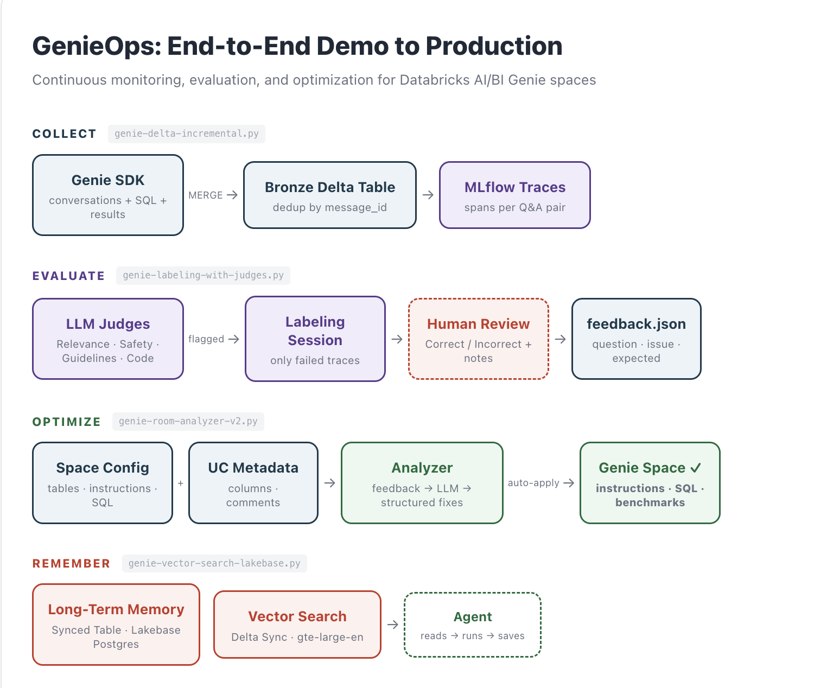

## GenieOps: End-to-End Demo to Production

### What is GenieOps?

GenieOps is a production-grade operations framework for Databricks AI/BI Genie spaces. Like MLOps for machine learning models, GenieOps brings structured monitoring, automated evaluation, human-in-the-loop review, and continuous optimization to text-to-SQL experiences — taking a Genie space from initial demo to production quality through a repeatable, data-driven improvement cycle. The entire framework is built on MLflow as its observability and evaluation backbone.

### The Four Stages

**1. Collect** — *Capture every interaction*

A daily pipeline pulls conversations from the Genie SDK and MERGEs them into a Bronze Delta table, deduplicating by `message_id`. Each Q&A pair — including the user question, generated SQL, query results, and feedback — is logged as an MLflow trace with structured spans: `text_to_sql` (RETRIEVER), `sql_execution` (TOOL), and `response_generation` (LLM). These traces become the single source of truth for everything downstream — evaluation, labeling, and analysis. A `_is_traced` flag on the table eliminates the need for a separate watermark.

**2. Evaluate** — *Automate quality scoring, escalate failures*

Traces pass through three tiers of automated judges using `mlflow.genai.evaluate()`. Built-in MLflow judges check relevance, safety, and groundedness. Custom LLM judges built with Guidelines and `make_judge` enforce Genie-specific rules around response quality and SQL correctness. Zero-cost `@scorer` functions catch structural issues like missing SQL or empty responses. Judge scores are attached directly to traces as MLflow assessments. Only traces that fail at least one check are routed to an MLflow labeling session — domain experts review flagged traces in the MLflow Review App, marking correctness and describing what went wrong.

**3. Optimize** — *Turn feedback into fixes, apply automatically*

Human feedback extracted from MLflow labeling sessions, current space configuration, and Unity Catalog metadata feed into an LLM analyzer. The analyzer call is wrapped with `@mlflow.trace` for full observability — every analysis run is logged with parameters, prompt versions (registered via MLflow Prompt Registry), and the recommendation output. The analyzer generates structured, copy-paste-ready fixes: text instructions, SQL expressions, example queries, join specs, benchmarks with expected SQL, column descriptions, and clarification rules. These are applied directly to the Genie space via the API, with a dry-run mode for safe review before committing.

**4. Remember** — *Learn from history*

A Vector Search index over the Bronze table enables semantic retrieval of similar past questions with their SQL and feedback scores. Long-term memory backed by a Lakebase synced table stores persistent knowledge — proven SQL patterns, user preferences, schema notes — that agents can query at runtime to inform better responses.

### Infrastructure

All storage runs on Databricks-native services. Conversations live in a Delta table with Change Data Feed enabled. MLflow experiments store all traces, evaluations, judge scores, and human labels in a unified lineage — from raw conversation to applied fix. The Vector Search index auto-syncs via Delta Sync using `databricks-gte-large-en` embeddings. Long-term memory is stored in a Lakebase Postgres instance and surfaced through synced tables for low-latency reads. Authentication is handled entirely through OAuth via the Databricks SDK.

### The Closed Loop

Each cycle compounds: better Genie responses produce cleaner conversations, which surface fewer failures in evaluation, which require less human review, which yield more targeted fixes. MLflow ties every stage together — a single experiment tracks the full journey from raw trace to judge score to human label to applied recommendation. Over time, the space self-corrects toward production-grade accuracy with decreasing manual effort.

### Modular & Extensible by Design

GenieOps is built as four independent, composable modules — not a monolith. Each stage works standalone and can be adopted incrementally or extended without touching the others.

Extend to new use cases:

- Multiple Genie spaces sharing the same MLflow experiment, evaluation, and memory infrastructure
- A/B testing space configurations by comparing evaluation runs with different feedback sets
- Fully automated nightly optimization via Databricks Workflows
- Executive dashboards built on the Bronze Delta table for Genie adoption and accuracy trends
- Trace-based alerting when judge pass rates drop below thresholds

The architecture is designed so that adopting one module delivers immediate value, and each additional module amplifies the others.

### Notebooks

| Stage | Notebook | Key Capabilities |
|---|---|---|
| Collect | `genie-delta-incremental.py` | MLflow traces with spans (CHAIN → RETRIEVER → TOOL → LLM) |
| Evaluate | `genie-labeling-with-judges.py` | `mlflow.genai.evaluate()`, judges, `@scorer`, labeling sessions, Review App |
| Optimize | `genie-room-analyzer-v2.py` | `@mlflow.trace`, Prompt Registry, auto-apply via Genie API |
| Remember | `genie-vector-search-lakebase.py` | Vector Search, Lakebase synced tables for long-term memory |